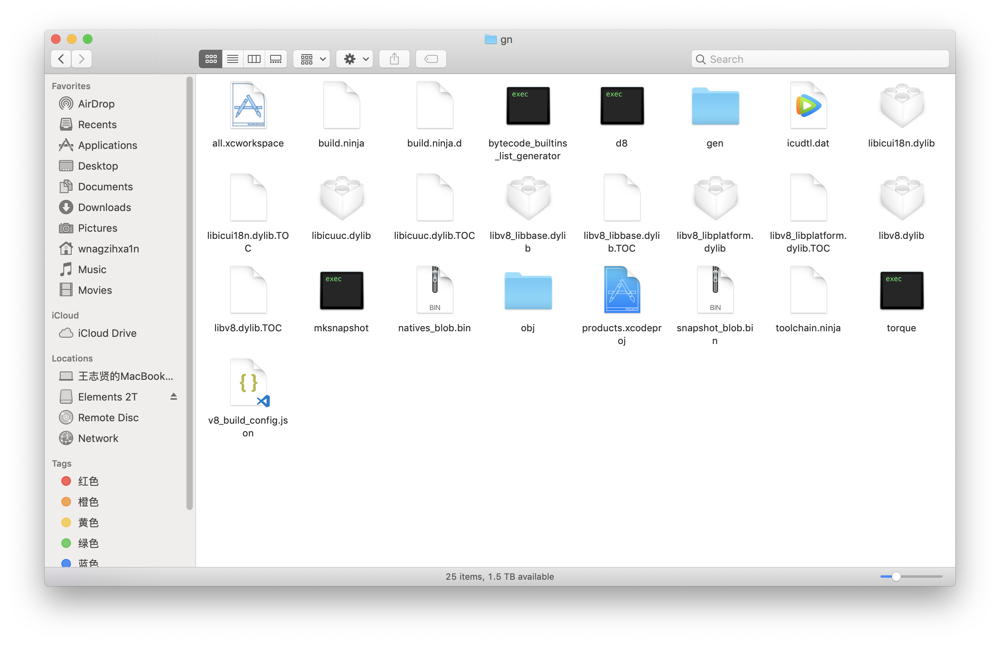
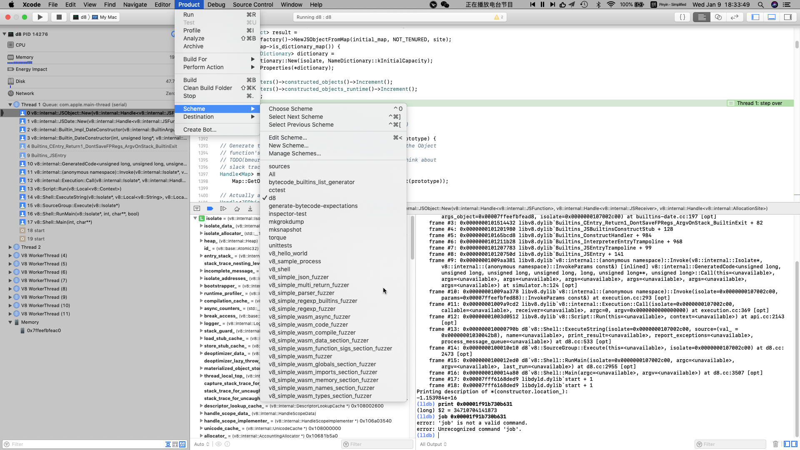
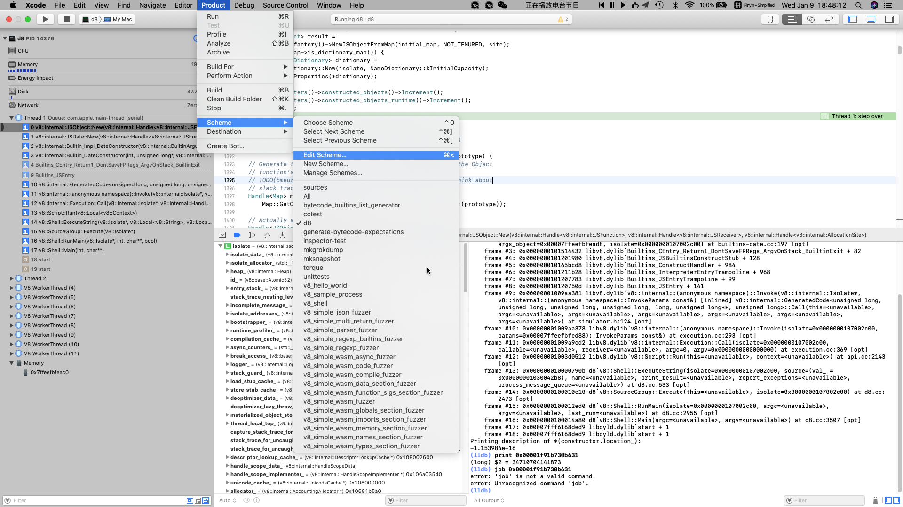
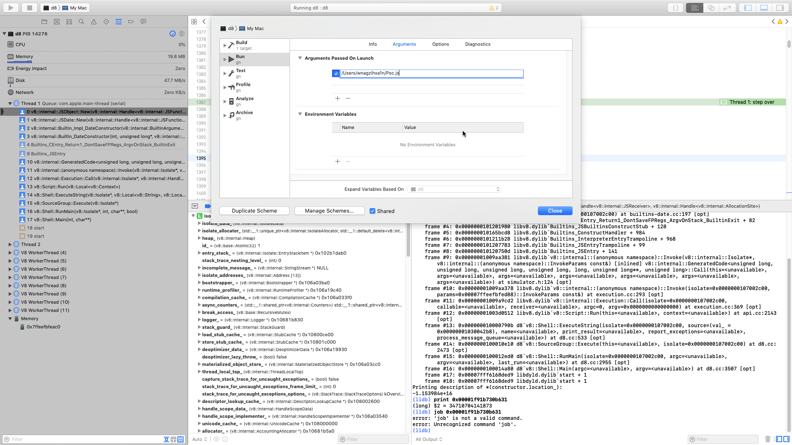

# macOS下使用Xcode调试V8源码

**Author:wnagzihxa1n
E-Mail:wnagzihxa1n@gmail.com**

因为网络比较好，所以我没有遇到过网络的问题

先把`depot_tools`下载回来
```
~ wnagzihxa1n$ git clone https://chromium.googlesource.com/chromium/tools/depot_tools.git
```

设置环境变量
```
~ wnagzihxa1n$ open -e .bash_profile
```

使新增的环境变量生效
```
~ wnagzihxa1n$ source .bash_profile
```

创建文件夹
```
Elements 2T wnagzihxa1n$ mkdir ChromeSourceDebug
Elements 2T wnagzihxa1n$ cd ChromeSourceDebug/
```

获取V8源码，不带历史数据
```
ChromeSourceDebug wnagzihxa1n$ fetch --no-history v8
ChromeSourceDebug wnagzihxa1n$ gclient sync
```

创建Xcode工程
```
v8 wnagzihxa1n$ gn gen out/gn --ide="xcode"
Generating Xcode projects took 43ms
Done. Made 128 targets from 78 files in 3659ms
```

创建Xcode工程的时候可能会出现错误
```
v8 wnagzihxa1n$ gn gen out/gn --ide="xcode"
ERROR at //build/config/mac/mac_sdk.gni:68:5: Script returned non-zero exit code.
    exec_script("//build/mac/find_sdk.py", find_sdk_args, "list lines")
    ^----------
Current dir: /Volumes/Elements 2T/ChromeSourceDebug/v8/out/gn/
Command: python /Volumes/Elements 2T/ChromeSourceDebug/v8/build/mac/find_sdk.py --print_sdk_path 10.12
Returned 1.
stderr:

Traceback (most recent call last):
  File "/Volumes/Elements 2T/ChromeSourceDebug/v8/build/mac/find_sdk.py", line 104, in <module>
    print main()
  File "/Volumes/Elements 2T/ChromeSourceDebug/v8/build/mac/find_sdk.py", line 71, in main
    'to continue.')
__main__.SdkError: 'Install Xcode, launch it, accept the license agreement, and run `sudo xcode-select -s /path/to/Xcode.app` to continue.'

See //build/toolchain/mac/BUILD.gn:15:1: whence it was imported.
import("//build/config/mac/mac_sdk.gni")
^--------------------------------------
See //BUILD.gn:708:1: which caused the file to be included.
action("js2c_extras") {
^----------------------
```

修改一下即可
```
v8 wnagzihxa1n$ sudo xcode-select -s /Applications/Xcode.app/Contents/Developer/
```

如果创建Xcode工程没有问题，就直接用Xcode打开这个工程，打开之后需要点时间让工程构建一下



修改`Product->Scheme`，把编译目标改为`d8`（请不要在意后面正在调试的代码）



再点击编译就行，我丢这编译着，第二天过来就编译好了，编译后的文件夹就是上面那个文件夹截图

稳稳的编译好，修改一下`Product->Scheme`



这样就可以带上参数调试



之后再打断点调试就很方便了，神奇的是，竟然没有网络的问题